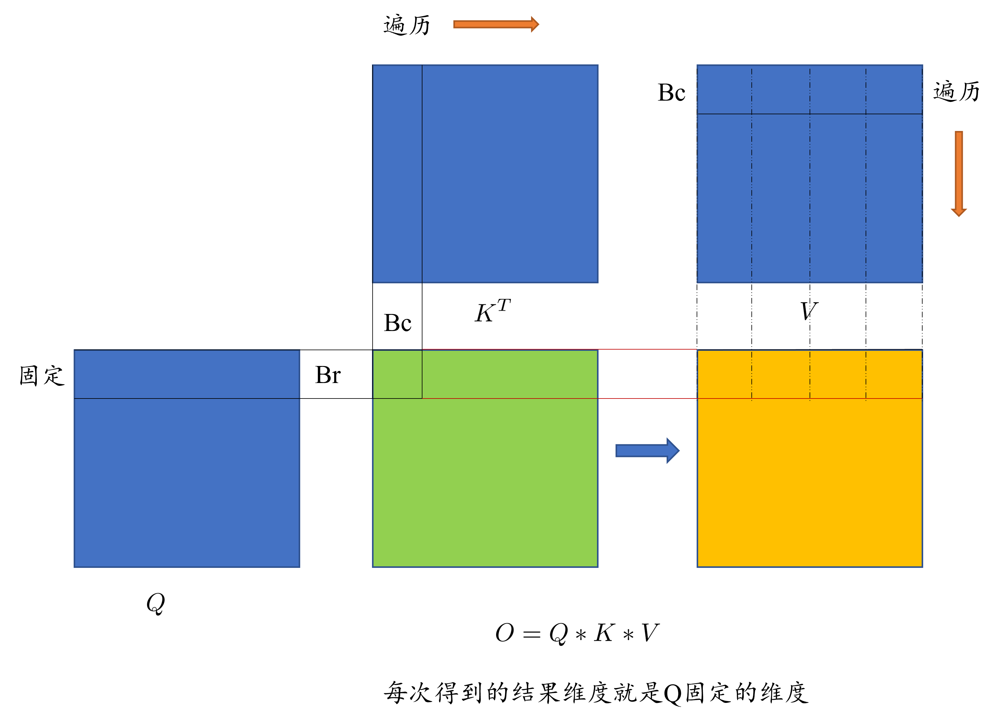
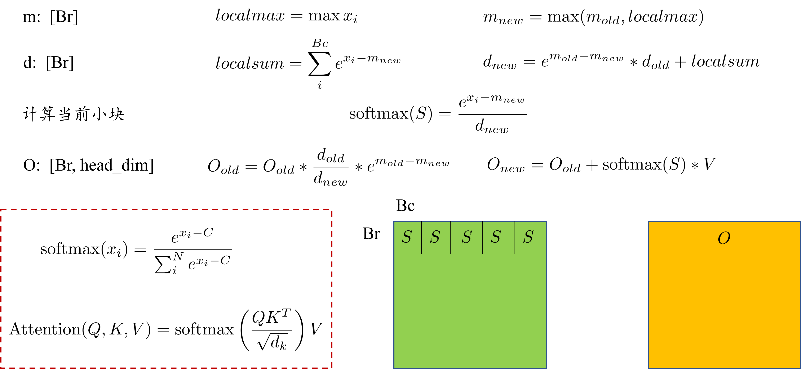

FlashAttention

完整demo: https://github.com/pesionzhao/Basic-GPU-Kernels/blob/master/flashattention/FA.cuh

$$
\text{Attention}(Q, K, V) = \text{softmax}\left( \frac{QK^T}{\sqrt{d_k}} \right) V
$$

传统的注意力计算需要先计算Q*K, 再计算softmax, 最后再乘以V, 需要不断从全局内存中读写，为了减小全局内存的读写次数，可以利用分块的思想

首先完成 Q * K * V

其中q*K按照矩阵乘法的分块思路进行，这里我们使用一维网格，也就是shared memory一次要读取Q的全部列和K的全部行，如下图所示，计算Q@K时，一个block计算可以得到[Br, Bc]的中间乘法结果（绿色方块的小格子）, 此时如果想得到与Q小块的维度相同的结果O(橙色块的红色区域)，需要遍历全部的K和V, 所以设置线程块大小为Q小块，内部对K和V进行遍历，对K循环可以逐渐得到绿色块中的红线部分，对V遍历并累加可以得到橙色块红色区域的最终结果，（具体原因可以参考虚线模拟计算过程理解）



矩阵乘法可以分块的问题可以解决，接下来结果softmax的分块问题

每次循环可以算出S的准确值，对当前的S进行归约得到最大值，与**之前计算过的S**的最大值进行比较得到**当前计算过的S**的最大值，然后根据这个最大值计算当前S的softmax，当遍历完所有S时，最后一个S块就可以得到正确的softmax结果，但之前的softmax值错了没法更改，这不重要，因为我们要求的是Attention的结果，只要最终结果正确就好，由于每次要对$O_{old}$进行累加，我们可以在累加的之前修正$O_{old}$，公式如下



这样的话遍历完K,V可以得到正确的O, 按照线程块排布并行计算Q固定的块，内部循环K和V即可完成attention的计算

```c++
// 每次读取k,v的Bc行都从全局内存中取
template<int BLOCK_SIZE, int HEAD_DIM>
__global__ void flashAttentionKernel(const float* q, const float* k, const float* v, float* dst, int batch, int num_head, int seq_len, int head_dim){
    //假设Q/K/V shape [batch, num_head, seq_len, head_dim]
    //block [head_dim, Br], grid[M/Br, bc*num_head]
    int bid = blockIdx.x*BLOCK_SIZE;
    int row = bid+threadIdx.y;
    int col = threadIdx.x;
    __shared__ float local_O[Br][Bc];
    int num_pack = (seq_len + Bc - 1)/Bc;
    float old_max = 0;
    float old_d = 0;
    const float* intputK = k+blockIdx.y*seq_len*head_dim;
    const float* intputV = v+blockIdx.y*seq_len*head_dim;
    __shared__ float intputQ[Br*HEAD_DIM];
    __shared__ float outputO[Br*HEAD_DIM];
    outputO[threadIdx.y*HEAD_DIM+col] = 0.0f;
    intputQ[threadIdx.y*HEAD_DIM+col] = q[blockIdx.y*seq_len*head_dim+row*HEAD_DIM+col];//固定Q
    __syncthreads();
    for(int pack_id = 0; pack_id<num_pack; pack_id++){
        float qk_res = 0.0f;
        for(int i = 0; i<head_dim; i++){
            //由于x方向线程数为head_dim, 大于bc, 在进行乘法时只需要bc个线程参与计算即可，这里使用求余防止分支发散，x方向上，每个bc块的元素都一样
            qk_res += intputQ[threadIdx.y*HEAD_DIM+i]*intputK[(pack_id*Bc+col%Bc)*HEAD_DIM+i];// Q*K^T
            // qk_res += intputQ[threadIdx.y*HEAD_DIM+i]*intputK[col%Bc+pack_id*Bc+seq_len*i];// Q * K
        }
        float cur_max = qk_res;
        // online softmax
        cur_max = warpReduce<MaxOp, Bc>(qk_res);
        cur_max = max(cur_max, old_max);
        float cur_sum_tmp = __expf(qk_res-cur_max);
        local_O[threadIdx.y][col%Bc]=cur_sum_tmp; // 不用同步，因为每个线程操作对应的shared memory
        float cur_sum = warpReduce<SumOp, Bc>(cur_sum_tmp); //只有Br行Bc的线程有用
        float alpha = __expf(old_max-cur_max);
        float new_d = alpha*old_d+cur_sum;
        local_O[threadIdx.y][col%Bc]/=new_d;
        outputO[threadIdx.y*HEAD_DIM+col] = outputO[threadIdx.y*HEAD_DIM+col]*old_d/new_d*alpha;
        __syncthreads();
        for(int i = 0; i<Bc;i++){
            outputO[threadIdx.y*HEAD_DIM+col]+=local_O[threadIdx.y][i]*intputV[(i+pack_id*Bc)*HEAD_DIM+col];
        }
        old_max = cur_max;
        old_d = new_d;
    }
    dst[blockIdx.y*seq_len*head_dim+row*HEAD_DIM+col] = outputO[threadIdx.y*HEAD_DIM+col];
};
```

**FlashAttention1**:
- 解决传统注意力计算的内存瓶颈（显存占用高）和计算效率问题

**FlashAttention2**:
- 调整 GPU 线程块分工，同时处理多个注意力头，提升吞吐量。进一步优化计算速度和并行性，支持更长的序列。

**FlashAttention3**:
- 结合硬件特性进一步优化，支持动态稀疏注意力,针对新一代 GPU（如 H100）的 Tensor Core 和 TMA（Tensor Memory Accelerator）优化。
