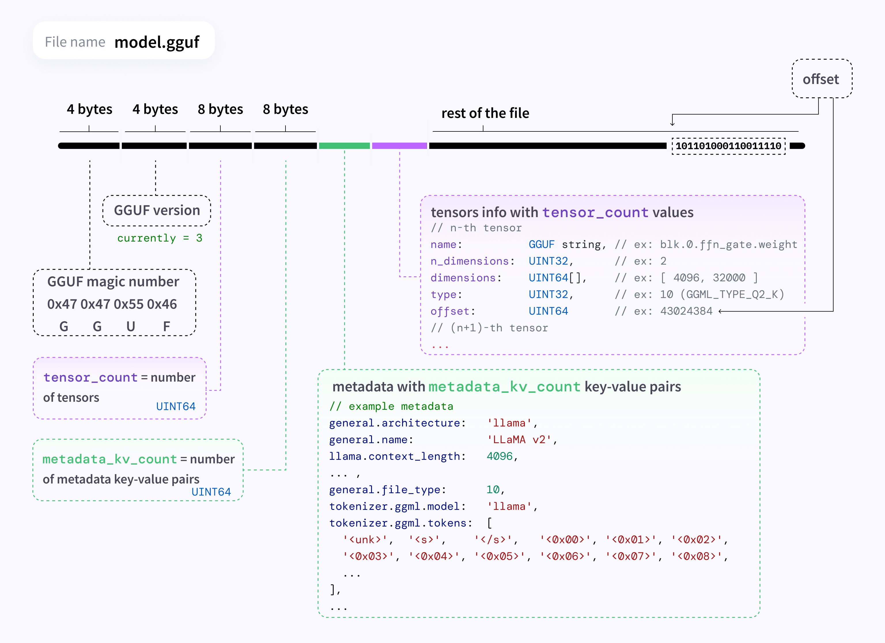

GGML推理框架主体

gguf文件架构



关键结构体

**context**

```c++
struct ggml_context_container {
    bool used;

    struct ggml_context context;
};
struct ggml_context {
    size_t mem_size;
    void* mem_buffer; //多态
    bool   mem_buffer_owned; //是否是自己创建的
    bool   no_alloc;
    bool   no_alloc_save; // this is used to save the no_alloc state when using scratch buffers

    int    n_objects; //object数量， object有gragh, tensor, work_buffer(后端计算结构)

    struct ggml_object * objects_begin;
    struct ggml_object * objects_end;

    struct ggml_scratch scratch;
    struct ggml_scratch scratch_save;
};
// ggml object
struct ggml_object {
    size_t offs;
    size_t size; //tensor+data

    struct ggml_object * next;

    enum ggml_object_type type;

    char padding[4];
};
// scratch buffer
struct ggml_scratch {
    size_t offs;
    size_t size;
    void * data;
};
```

计算图

```c++
// computation graph
struct ggml_cgraph {
    int size;
    int n_nodes; //节点数
    int n_leafs; //叶子节点数（无梯度计算）

    struct ggml_tensor ** nodes;
    struct ggml_tensor ** grads;//nodes的梯度
    struct ggml_tensor ** leafs;

    struct ggml_hash_set visited_hash_set;

    enum ggml_cgraph_eval_order order;  //遍历方式
};
```

ggml_tensor

```c++
// n-dimensional tensor
struct ggml_tensor {
    enum ggml_type         type;

    GGML_DEPRECATED(enum ggml_backend_type backend, "use the buffer type to find the storage location of the tensor");

    struct ggml_backend_buffer * buffer;

    int64_t ne[GGML_MAX_DIMS]; // number of elements 每个维度的长度
    size_t  nb[GGML_MAX_DIMS]; // stride in bytes: 访问某一维度的元素时需要跳跃的步长
                                // nb[0] = ggml_type_size(type)
                                // nb[1] = nb[0]   * (ne[0] / ggml_blck_size(type)) + padding
                                // nb[i] = nb[i-1] * ne[i-1]

    // compute data
    enum ggml_op op;

    // op params - allocated as int32_t for alignment
    int32_t op_params[GGML_MAX_OP_PARAMS / sizeof(int32_t)];

    int32_t flags;

    struct ggml_tensor * grad;
    struct ggml_tensor * src[GGML_MAX_SRC]; //前驱节点，用于构建计算图

    // source tensor and offset for views
    struct ggml_tensor * view_src;
    size_t               view_offs;

    void * data;

    char name[GGML_MAX_NAME];

    void * extra; // extra things e.g. for ggml-cuda.cu

    // char padding[4];
};
```

全部变量ggml_state

```c++
struct ggml_state {
    struct ggml_context_container contexts[GGML_MAX_CONTEXTS];//提前创建好64个contexts
    struct ggml_numa_nodes numa; //内存分区，同一个区之间读写更快
};

// global state
static struct ggml_state g_state;
```

GGUF相关

```c++
struct gguf_init_params {
    bool no_alloc;
    // if not NULL, create a ggml_context and allocate the tensor data in it
    struct ggml_context ** ctx;
};
```

```c++
struct gguf_context {
    struct gguf_header header;

    struct gguf_kv          * kv;
    struct gguf_tensor_info * infos;

    size_t alignment;
    size_t offset;    // offset of `data` from beginning of file
    size_t size;      // size of `data` in bytes

    //uint8_t * padding;
    void * data;
};
```

```c++
struct gguf_kv {
    struct gguf_str key;

    enum  gguf_type  type;
    union gguf_value value;
};

struct gguf_header {
    char magic[4];

    uint32_t version;
    uint64_t n_tensors; // GGUFv2
    uint64_t n_kv;      // GGUFv2
};

struct gguf_tensor_info {
    struct gguf_str name;

    uint32_t n_dims;
    uint64_t ne[GGML_MAX_DIMS];

    enum ggml_type type;

    uint64_t offset; // offset from start of `data`, must be a multiple of `ALIGNMENT`

    // for writing API
    const void * data;
    size_t size;
};
```

网络部分

```c++
struct mnist_model {
    std::string arch;
    int nbatch;

    struct ggml_tensor  * images = nullptr;
    struct ggml_tensor  * labels = nullptr;
    struct ggml_tensor  * logits = nullptr;
    struct ggml_tensor  * probs  = nullptr;
    struct ggml_tensor  * loss   = nullptr;

    struct ggml_tensor * fc1_weight = nullptr;
    struct ggml_tensor * fc1_bias   = nullptr;
    struct ggml_tensor * fc2_weight = nullptr;
    struct ggml_tensor * fc2_bias   = nullptr;

    struct ggml_tensor * conv1_kernel = nullptr;
    struct ggml_tensor * conv1_bias   = nullptr;
    struct ggml_tensor * conv2_kernel = nullptr;
    struct ggml_tensor * conv2_bias   = nullptr;
    struct ggml_tensor * dense_weight = nullptr;
    struct ggml_tensor * dense_bias   = nullptr;

    static const size_t size_weight  = 100 *      1024*1024;
    static const size_t size_compute =   1 * 1024*1024*1024;

    void                * buf_weight  = nullptr;
    struct ggml_context * ctx_weight  = nullptr;
    void                * buf_compute = nullptr;
    struct ggml_context * ctx_compute = nullptr;

    mnist_model() {
        //100M
        buf_weight = malloc(size_weight);
        {
            struct ggml_init_params params = {
                /*.mem_size   =*/ size_weight,
                /*.mem_buffer =*/ buf_weight,
                /*.no_alloc   =*/ false,
            };
            ctx_weight = ggml_init(params);
        }

        buf_compute = malloc(size_compute);
        {
            struct ggml_init_params params = {
                /*.mem_size   =*/ size_compute,
                /*.mem_buffer =*/ buf_compute,
                /*.no_alloc   =*/ false,
            };
            ctx_compute = ggml_init(params);
        }
    }

    ~mnist_model() {
        ggml_free(ctx_weight);
        ggml_free(ctx_compute);

        free(buf_weight);
        free(buf_compute);
    }
};
```

mnist数据集验证流程

### mnist_graph_eval

第一次调用ggml_init时

- 构建32->16量化表
- 初始化g_state(GGML_MAX_CONTEXTS个ggml_context)


- 读取gguf文件
- 读取文件大小+32(object)+336(tensor)作为ggml_context的内存大小
- 开辟ggml_context的空间
- 给object和tensor的空间赋值

### mnist_model_init_from_file
mnist_model默认构造:开辟100M的buf_weight和1G的buf_compute(2段ggml_context)，并在这段空间中指定ctx_weight和ctx_compute

- 开辟一个`gguf_context` ctx
- 按照gguf存储格数读取数据到ctx，依次为(GGUF, version, n_tensors, n_kv)
- 开辟n_kv个ctx->kv(`gguf_kv`)，并赋值
- 开辟n_tensors个ctx->infos(`gguf_tensor_info`)并赋值
- 数据对齐，找到data的起始指针
- 之后是n_tensors个数据的data, 每次读完都要进行padding到alignment倍数，计算数据的大小赋值给ctx->size
- 开辟空间大小为ctx->size+(n_tensors+1)*overhead的ggml_context，赋与params.ctx
- 创建一个ggml_tensor，进行读取gguf中的data，并给ctx->data空间赋值
- 在params.ctx中构建object和tensor，并赋值
- 按照`ctx->infos[i].offset`给params.ctx中的tensor的data赋值
- 对着model.ctx_weight给model.fc1_weight等权重赋值
  
### mnist_model_build
- 在model.ctx_compute中指定梯度存放位置
- 根据forward申请内存，为计算图中的所有生成的临时变量在ctx_compute中指定地址，包括梯度

### mnist_model_eval
- 接着在ctx_compute为图指定空间，依次声明obj,cgraph中元素的存放地址
- 从最后一个节点开始向上遍历，给hash赋值
