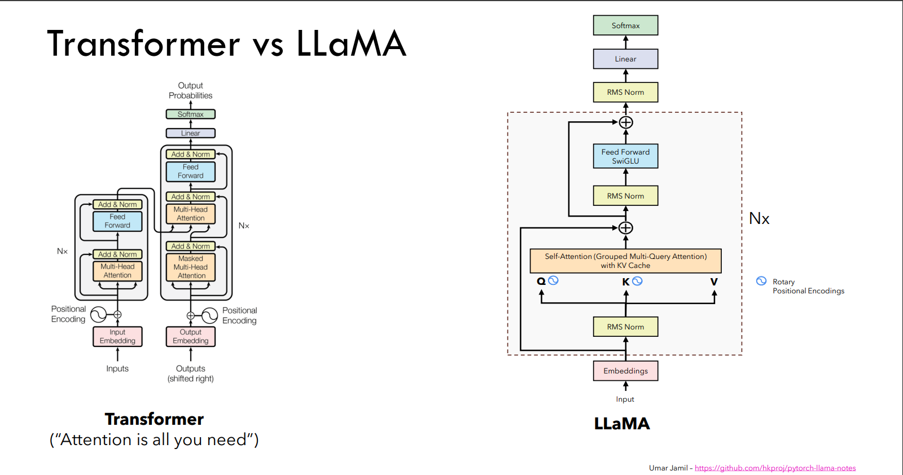

## llama

参考链接：

https://github.com/hkproj/pytorch-llama-notes/

https://www.bilibili.com/video/BV18p421273J?spm_id_from=333.788.videopod.sections&vd_source=c43347ef375755d298da8f0c05cfe444

[旋转式位置编码 (RoPE) 知识总结](https://zhuanlan.zhihu.com/p/662790439)

[Transformer升级之路：2、博采众长的旋转式位置编码](https://spaces.ac.cn/archives/8265/comment-page-1)

[位置编码之路：SIN->ALiBi->RoPE ->PI->NKT->YARN](https://zhuanlan.zhihu.com/p/1894384438206505105)

[【8】KV Cache 原理讲解](https://www.bilibili.com/video/BV17CPkeEEzk?spm_id_from=333.788.videopod.sections&vd_source=c43347ef375755d298da8f0c05cfe444)


结构图




创新点：

### RMSNorm 用于加速训练

$ \text{RMSNorm}(x) = \frac{x}{\sqrt{\frac{1}{d} \sum_{i=1}^{d} x_i^2 + \epsilon}} \cdot \gamma $

```python
class RMSNorm(nn.Module):
    def __init__(self, dim: int, eps: float = 1e-6):
        super().__init__()
        self.eps = eps
        # The gamma parameter
        self.weight = nn.Parameter(torch.ones(dim))

    def _norm(self, x: torch.Tensor):
        # (B, Seq_Len, Dim) * (B, Seq_Len, 1) = (B, Seq_Len, Dim)
        # rsqrt: 1 / sqrt(x)
        return x * torch.rsqrt(x.pow(2).mean(-1, keepdim=True) + self.eps)

    def forward(self, x: torch.Tensor):
        # (Dim) * (B, Seq_Len, Dim) = (B, Seq_Len, Dim)
        return self.weight * self._norm(x.float()).type_as(x)
```

### SwiGeLU 作为激活函数

$$\text{SwiGeLU(x)} = \text{Swish}(xW+b) \otimes (xV+b) $$

$$\text{Swish}(x) = x \cdot \sigma(\beta x)$$

$$\sigma(x) = \frac{1}{1 + e^{-x}}$$

### RoPE
旋转位置嵌入（Rotary Position Embedding, RoPE）是一种为序列模型（如Transformer）提供位置编码的方法。RoPE通过将输入向量在复数域进行旋转变换，来编码序列中位置的信息。出发点就是“通过绝对位置编码的方式实现相对位置编码”, **不同于Sinusoidal的加法性位置编码，RoPE为乘法性的位置编码**

若叠加位置信息后的向量 \(q\)（位置 \(m\)）和 \(k\)（位置 \(n\)）的内积可以表示为它们之间距离差 \(m - n\) 的函数，则能体现它们的相对位置关系。即我们希望找到以下等式的一组解：

\[
\langle f(q, m), f(k, n) \rangle = g(q, k, m - n)
\]

RoPE为该等式提供了一组解：

\[
f(q, m) = q e^{i m \theta}, \quad f(k, n) = k e^{i n \theta}
\]

此时，两向量的内积（在复数域中转为共轭内积后取实部）会包含相对位置关系 \(m - n\)：

\[
\langle f(q, m), f(k, n) \rangle = \text{Re}\left[ q e^{i m \theta} \cdot k e^{-i n \theta} \right] = \text{Re}\left[ q \cdot k e^{i (m - n) \theta} \right]
\]

根据复数乘法的几何意义，此操作等价于向量的旋转，因此称为**旋转式位置编码**。其矩阵形式表示为$f(q, m) = \bold{R}_m \cdot q$：

\[
f(q, m) = 
\begin{pmatrix}
\cos m\theta & -\sin m\theta \\
\sin m\theta & \cos m\theta
\end{pmatrix}
\begin{pmatrix}
q_0 \\
q_1
\end{pmatrix}
\]

可以看到一个$\theta$可以对应一个复平面上的二维坐标 ( $q_0, q_1$ 分别代表实部和虚部), 如果q,k不是二维的呢，也就是head_dim > 2, RoPE 中的做法是: 对向量的维度进行分组操作, 相邻的两个维度作为一组, 一共可以分成$d / 2$组, 每组旋转$m \cdot \theta_i$度。此时, $R_m$变成:

$$ \bold{R}_m = \scriptsize{\left[ \begin{array}{cc:cc:cc:cc} \cos m\theta_0 & -\sin m\theta_0 & 0 & 0 & \cdots & \cdots & 0 & 0 \\ \sin m\theta_0 & \cos m\theta_0 & 0 & 0 & \cdots & \cdots & 0 & 0 \\ \hdashline 0 & 0 & \cos m\theta_1 & -\sin m\theta_1 & \cdots & \cdots & 0 & 0 \\ 0 & 0 & \sin m\theta_1 & \cos m\theta_1 & \cdots & \cdots & 0 & 0 \\ \hdashline \vdots & \vdots & \vdots & \vdots & \ddots & \ddots & \vdots & \vdots \\ \vdots & \vdots & \vdots & \vdots & \ddots & \ddots & \vdots & \vdots \\ \hdashline 0 & 0 & 0 & 0 & \cdots & \cdots & \cos m\theta_{d/2-1} & -\sin m\theta_{d/2-1} \\ 0 & 0 & 0 & 0 & \cdots & \cdots & \sin m\theta_{d/2-1} & \cos m\theta_{d/2-1} \\ \end{array} \right]} $$

$\theta_i$沿用Sinusoidal的设置， i表示d维度方向上的索引

$$ \theta_i = 10000^{-2i/d} \tag{4.3} $$

#### 性质与扩展 By GPT
1. **线性叠加性**：  
   矩阵形式的 \(f\) 满足线性叠加性质，即对任意位置 \(m_1, m_2\)，有：
   \[
   f(q, m_1 + m_2) = f(f(q, m_1), m_2)
   \]

2. **高维扩展**：  
   对于高维向量 \((q_0, q_1, \dots, q_d)\)，可将其划分为多个二维子向量，并对每个子向量独立应用旋转操作：
   \[
   f(q, m) = \bigoplus_{k=1}^{d/2} 
   \begin{pmatrix}
   \cos m\theta_k & -\sin m\theta_k \\
   \sin m\theta_k & \cos m\theta_k
   \end{pmatrix}
   \begin{pmatrix}
   q_{2k} \\
   q_{2k+1}
   \end{pmatrix}
   \]
   其中 \(\theta_k = 10000^{-2k/d}\)（类似 Sinusoidal 编码的频率衰减设计）。

---
