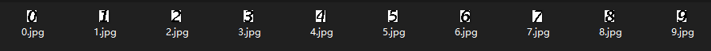
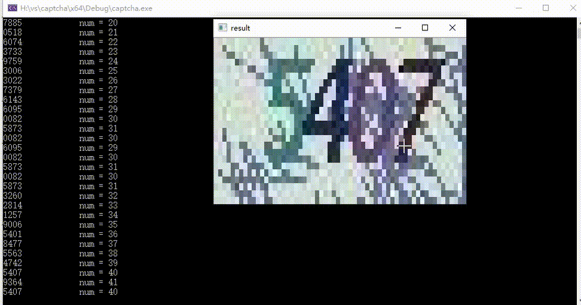

# 吉林大学教务系统验证码识别方案

verification code classification

代码链接：[https://gitee.com/cocoon-storage/jlu_-captcha](https://gitee.com/cocoon-storage/jlu_-captcha)

## 前言
每次登录吉林大学教务系统时，谷歌浏览器可以保存账号密码不用再次输入，可是验证码却每次都要输入一次，很麻烦，这我某个大佬学长网站的需求，我正好当时也在做视觉,就想着能不能做一个出来，然后他把数据集发给我，我开始了尝试

## 图像分析

         

首先观察图像特征：

- 每个数字的高度都是一样的，且无形变。(很重要！！)
- 每个数字颜色都一样
- 背景噪声无序，放大观察后严重干扰数字的整体性

## 思路

### 踩坑思路
借鉴之前学习opencv时的车牌识别思路：即将图像进行二值化->进行腐蚀，直到四个数字合并到一个连通域中，然后在原图等间隔分割出来，进行滤波去噪，最后遍历模板匹配得到数字

**缺点**
数字仅仅高度相同，宽度却不相同，分割后的数字还会有很多噪声会导致模板匹配正确率下降，这里可能采取机器学习会更好，但是最麻烦的是标注，学长给我的数据集都是没有标注过的,所以我干脆放弃了这个方案:joy:

### 最终方案

既然标注不现实，我也就放弃了深度学习这个方案，这时候我发现了这些数字的字形是不变的！！也就是说我不需要电脑自己去学习这个模型，我可以自己把这个数字的模板构建出来，之后遍历进行匹配就可以的，我看:star:

使用opencv自带的鼠标回调可以很方便的构建模板，接下来就是绘画环节

```c++
void mark()//抠图，左键变白右键变黑
{
	void onMouseCallBack(int event, int x, int y, int flags, void* pUserData);
	while(1)
	{
		namedWindow(windowName, WINDOW_NORMAL);
		imshow(windowName, src);
		cv::setMouseCallback(windowName, onMouseCallBack, reinterpret_cast<void*> (&src));
		char q = waitKey(0);
		if (q == 27)
		{
			cv::destroyWindow(windowName);
			imwrite("H:\\深度学习源码学习\\moban\\8.jpg", src);//保存抠图完成的模板
		}
		if (q == 'q')
		{
			cv::destroyWindow(windowName);//不保存退出
			break;
		}
	}
}

void onMouseCallBack(int event, int x, int y, int flags, void* pUserData)//鼠标事件回调
{
	//创建保存像素值的3字节容器
	cv::Vec3b pixel;
	//空指针强制类型装换成图片指针pMat
	cv::Mat* pMat = reinterpret_cast<cv::Mat*>(pUserData);

	//鼠标左键按下时，返回坐标和RGB值，将其变白
	if (event == CV_EVENT_LBUTTONDOWN )
	{
		if (src.channels() == 1)
		{
			int pixel1;
			//获取像素值
			pixel1 = pMat->at<uchar>(y, x);//y是row，x是col
										  //输出像素值的（R，G，B）
										  //cv重载了<<运算符，可以输出Vec3b类型，但是按B,G,R输出
			cout << "at(" << x << "," << y << ")-->pixel(1)=" << pixel1 << endl;
			src.at<uchar>(y, x) = 255;
		}
	}
    //鼠标右键按下时，返回坐标和RGB值，将其变黑
	if (event == CV_EVENT_RBUTTONDOWN)
	{
		if (src.channels() == 1)
		{
			int pixel1;
			//获取像素值
			pixel1 = pMat->at<uchar>(y, x);//y是row，x是col
										  //输出像素值的（R，G，B）
										  //cv重载了<<运算符，可以输出Vec3b类型，但是按B,G,R输出
			cout << "at(" << x << "," << y << ")-->pixel(1)=" << pixel1 << endl;
			src.at<uchar>(y, x) = 0;
		}
	}
}
```

抠图结束后得到9个模板


之后就是debug环节

过程中我发现了数字的高度是一样的，而且在图像中的高度位置也是固定的，而且每个数字也有10像素左右的宽度，所以我缩小了循环范围，只在相同高度进行遍历，且识别到一个数字之后跳跃8个像素识别下一个数字

匹配思路为：

- 将图像进行灰度处理，由于**每个数字颜色都是一样的**，所以在灰度图像中灰度级是连续的
- 遍历套用模板，求在模板的位置像素的方差与极差，并以其作为阈值进行筛选，极差低于阈值就判定为该模板所代表的数字，极差高于阈值则继续遍历

进过20张图左右的debug，对模板模板进行了一些改动

以下为新的9个模板


之后就是验证环节，对数据集一一验证，如果遇到问题就拿图进行debug，基本没什么大问题

值得注意的是 **3** 和 **8** 字形有一半是相同的，因为我的遍历顺序是1-2-3-4-5-6-7-8-9-0，所以如果先拿3的模板去匹配8这个数字的话，很容易会误识别，我将模板的遍历顺序反转，以及就是先进行8的识别，如果匹配就认为该数字是8，不匹配的话再进行3的匹配

最终大功告成，数据集进行了2000张验证都没有误识别或错识别的情况，我将源代码发给学长，学长整合了网站上获得了很丝滑的效果！！

## 最终效果

