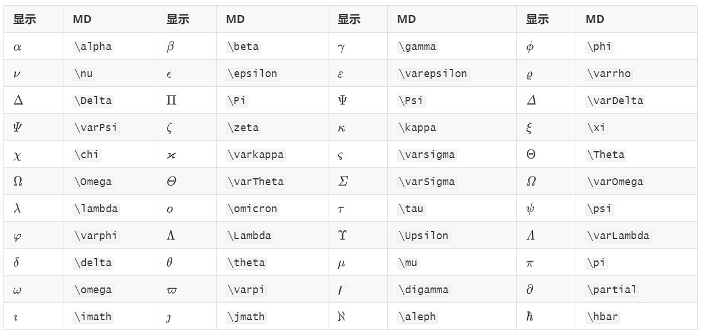

## 常用字符

| $\to$                 | \to     | $\times$      | \times    | $\div$                            | \\dive        |
| :-------------------- | ------- | ------------- | --------- | --------------------------------- | ------------- |
| $\sqrt x$             | \sqrt   | $\frac{x}{y}$ | \frac{}{} | $x\cdot y$                        | \cdot         |
| $\lim_{x \to \infty}$ | \lim_   | $\sum_n^4$    | \sum_^    | $\displaystyle \lim_{x\to\infty}$ | \displaystyle |
| $\overline x$         |\overline| $\hat{H}$     | \hat{H}   | $\bold x$                         | \bold x       |
| $\alpha$              | $\beta$ | $\gamma$      | $\lambda$ | $\Delta$                          | $\omega$      |

## 希腊字母

