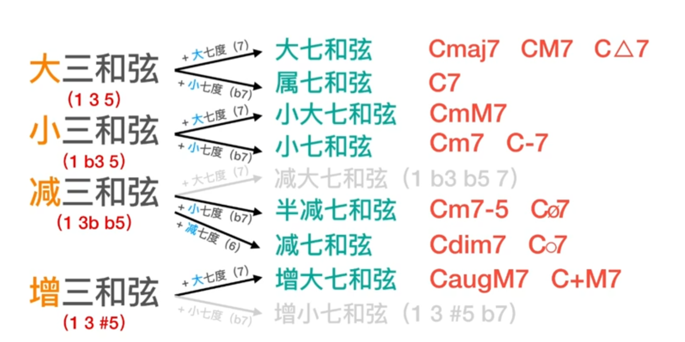
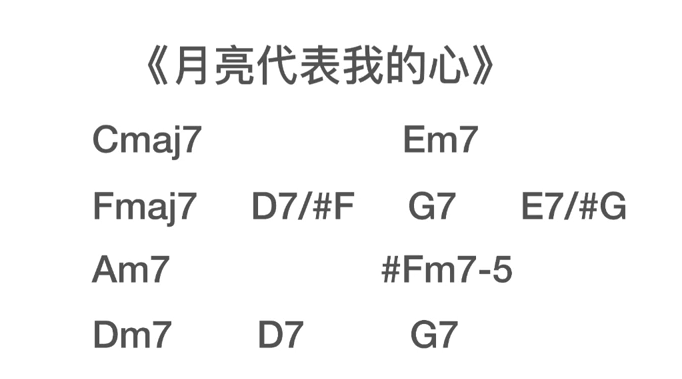

键盘即兴伴奏

柱式和弦

大和弦+9, 小和弦+7

常用技巧

- 击弦，滑弦
- 万能手型 #G D G, 加在右手会有一种爵士味道
- 小和弦过度，遇到两个相邻小和弦，中间差了一个半音，可在中间加该半音对应的小和弦，凑顺子
- 保持音，保持最高音

增四度替代

- #F 代替 C
- bE(bE, F, A, C之后琶F和弦) 代替 A
- bD 代替 G

挂留和弦

sus2稳定， sus4不稳定, 可以将G换为Gsus4

奇怪的G -> G(根音沉底)

- F/G
- Gsus4

如果旋律音和和弦最高音打架，要视情况改变(改变最高音/把最高音换到低八度)

45362511

Fadd9,G/F,Em7,Am7,Dm7,奇怪的G,G,Caddd9,C7

转位和弦：改变色彩

- 凑顺子
- 推动情绪

半分解和弦，左手加音

全分解和弦

- C:15125215
- D:26241426
- E:37352537
- F:41451541 

右手双音

- 三度
- 六度
- 四度:民乐
- 五度:吉他强力和弦

练习曲目

2-5-1 用于过渡

- 大调 Dm(小),G(属七),C(大)
- 小调 Bdim(减),E(大),Am(小)

E,A,D和弦升级

- sus4
- 转位
- 三度上行推进: 135->13+24+35(根音跟着变)