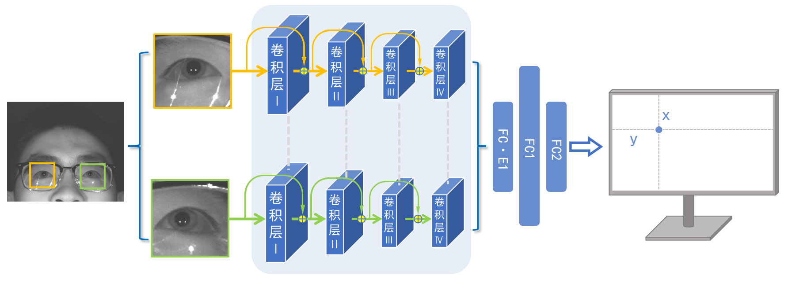

# 单相机双光源的屏幕式眼动交互技术

代码链接：[https://gitee.com/cocoon-storage/gaze-estimate](https://gitee.com/cocoon-storage/gaze-estimate)

### 前言

视线估计就是通过设备采集到的眼部图像，经过计算，预测视线的落点。

现阶段主流的两种方法为基于特征与基于外观两种方式

- 基于特征：利用高分辨相机与特定光源，计算精细眼部参数，利用几何光学原理计算瞳孔三维方向向量
- 基于外观：不需要特定光源，利用数据集与标签通过特定神经网络训练得到映射关系

为了进行高帧率眼动交互，本文采用了基于深度学习的单相机双光源识别方法，研究了反射光斑与视线落点的关系，得到了由眼图到视线落点的映射规律，搭建了一套具有眼动交互功能的仪器，训练出准确率较高的模型，能够起到实时识别用户视线落点并进行交互的功能，解决了视线估计数学模型复杂，运算量大的问题，具有心理学、社会学研究，广告营销、游戏以及虚拟现实等应用价值。

### 设备搭建

本文搭建的系统由以下几个部分组成

- 采图设备为大恒相机MER-131-210U3M，最高分辨率为1280*1080，帧率为500fps
- 两个波长为850nm的红外光源（型号），与相机共线。
- 850nm的带通滤波器，将可见光全部滤掉，是相机采到的图片光源只有实验所用的两个光源，避免自然光的干扰。
- 运算平台为台式电脑。i7，GTX3090
- 测试设备也为该电脑。显示器分辨率为1920*1280
- 头拖，用于固定头部

硬件设备如下图

测试设备如下图

### 数据集制作

利用数据集训练目标检测模型，用来检测眼睛。
目前的开源数据集像素很低，且不符合本文所研究的方案，故我们选择自行拍摄数据集

我们将设备搭建完成之后，在学校选取一部分志愿者进行数据集的拍摄，步骤如下，志愿者将头放到头托上，距离屏幕60cm，使用预先编写好的脚本，用户眼睛注视鼠标的位置，鼠标右键单击视为标注一张图片，后台自动存两只眼睛的图像(image)自适应缩放到同一大小，以及落点的位置(json)，由于志愿者需要长时间专注于屏幕，故我们将屏幕背景设为暗绿色，这样既减缓眼部疲劳，又可以提高标注效率。每人标1000张，其标注点均匀的分布在屏幕上，这样可以提高模型的泛性。

利用编写好的脚本采集数据集

最终得到数据集如下，标签格式为[x,y]，即屏幕落点

### 模型

本文所介绍的方法涉及到两个模型，通过模型串联的方式进行眼动交互。

第一个模型目标为检测眼睛，输入高分辨率图，输出眼睛的位置（xyxy)

第二个模型目标为视线落点估计，输入为两张眼图，输出为落点的位置(xy)

model1

借鉴了yolov5s的思路，将追求速度的同时保证精度，由于使用场景将可见光全滤掉，背景单一，眼部特征又较为明显，采用跨阶段网络作为主干解决梯度重复问题，减小计算开销，特征层多尺度融合提高模型精度。

结构如下

model2

借鉴了gazecapture的思路，舍弃了模型输入分支中的原图以及头部所在位，仅有左右眼两个图片作为两个输入，由于拍摄环境滤掉了所有的可见光，整体对比度偏低，故我们在预处理时对其进行直方图均衡化处理增强其对比度，借鉴yolov5的技巧在输入图像大小不同的情况下将其统一为相同尺寸以保证准确性，整体架构借鉴resnet，利用网络前向计算的残差信息，以获得更全面的特征。

结构如下

### 输出校正

在模型训练好后，需要进行输出矫正以保证准确性与平滑程度

**线性映射**：训练结果仅对原本屏幕分辨率的情况使用，若要求泛性，需要在每次更换使用者或电脑设备时对其进行线性映射，具体方法为：对应屏幕上的五个固定点，要求用户依次注视这五个点，后台自动记录预测结果，通过计算将预测结果进行线性映射到屏幕范围内

**聚类**：由于每一帧的图片细节都会发生变化，这些细微信息送入网络可能引起预测的敏感波动，故我们采用了聚类的方法，充分利用过去预测点的信息，并对当时的预测做出平均，我们具体方法为对前五帧的预测点求均值即为当前预测结果

### 仿真实验，数据对比

我们使用不同的受试者，在使用头托固定头部的情况下，对屏幕9个固定点依次进行注视，后台记录预测结果，利用空间几何关系，计算出预测点与真实点的角度偏差，表格6°

### 前后端融合

我们将此成果与前端界面结合，融合成为一个可以用户体验与消费的产品，将视线估计点量化为鼠标位置，用户即可通过眼动交互来控制计算机进行操作

界面以及功能如下

菜单

眼动键盘输入

大幅度图片切换

### 总结

在我们的工作中，主要利用了反射光斑的特征，结合传统算法与深度学习，将明显特征送入网络学习，即省去了传统算法构建几何模型的困难，又为深度学习提供了明显的特征去构建模型，真正做到了易复现，易使用等优点，且达到了80的帧率。但是设备仍有不易安装，操作复杂等不足，精度也有很大提升空间，以在未来的研究中做进一步优化。
