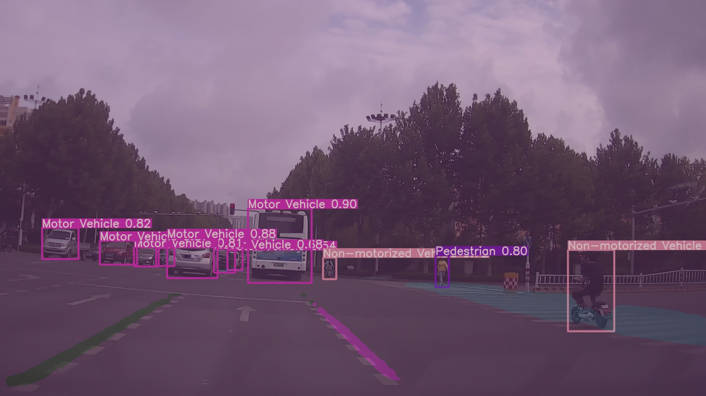

# 百度大数据竞赛划水记录

*所用代码均为主流深度学习模型架构，只是简单调参，故没有开源*

赛题为车载影像

aistudio 平台，所以我最先使用paddle框架进行尝试，baseline给的模型为**ppyolo**,尝试的跑了一天，结果ap惊人的才0.02，交流群里很多人也是这样，所以我果断放弃，后来发现可能是因为锚框的大小选取有问题，先进行**autoAnchor聚类**得到最佳锚框可能会获得更好的结果，但是我没有进行尝试

之后转战**faster-rcnn** 因为提交结果对模型的大小有限制，必须在200m以内，而我这个还单单只是检测的模型，故我选用**resnet-18**作为骨干，head使用**fpn**提高感受野，验证集ap能达到0.18！此时提交f=0.2瞬间升到了前十

之后便开始了无脑调参之旅。。。大无语事件接连发生

- 拿默认配置文件训练一晚上直接报错，报错原因好像是验证的时候tensor出现了-1的情况，所以无法计算ap，程序就直接停止了，这个错误在相同代码第二次跑的时候就消失了，玄学:sweat_smile:
- 默认学习率进行训练时，几个batch过后loss直接变为nan，只能降低学习率0.001:sweat_smile:
- **cascade rcnn** 的ap倒是可以稳步上升，但是模型导出超过了200m，paddle暂不支持rcnn模型的压缩:broken_heart:

所以就这样一次训练不如一次，干脆放弃了，如果有幸进复赛再好好搞

---


就这一个草率的模型居然以30多名的成绩进了复赛（好水），复赛就不一样了

复赛我毅然决然的放弃了paddle，用最火的yolov5尝试一下，因为之间经常跑yolov5，其性能和速度都是很不错的，接下来就开始跑了

---

## 目标检测--YOLOV5

### 数据处理

本次比赛所用数据格式为coco格式(但不完全是)，标注数据只有图像名称，bbox坐标，连通域信息

所以如果要用主流网络训练的话建议先将次数据转为coco数据格式，yolov5官方给出了各种数据转为yolo格式代码

我更改以后如下

``` python
import json

import cv2
import pandas as pd
from PIL import Image

from utils import *

def convert_coco_json(json_dir='../coco/annotations/', use_segments=False, cls91to80=False):
    save_dir = make_dirs()  # output directory
    coco80 = coco91_to_coco80_class()

    # Import json
    for json_file in tqdm(Path(json_dir).resolve().glob('*.json')):
        fn = Path(save_dir) / 'labels' # / json_file.stem.replace('instances_', '')  # folder name
        with open(json_file) as f:
            data = json.load(f)

        # Create image dict
        # images = {'%g' % x['id']: x for x in data['images']}

        # Write labels file
        # if x['iscrowd']:
        #     continue
        img_path = os.path.join('../train (1)/train/image/', json_file.stem)
        frame = cv2.imread(img_path + '.jpg')
        h, w, f = frame.shape[0], frame.shape[1], json_file.stem
        for x in data:

            # img = images['%g' % x['image_id']]
            # h, w, f = img['height'], img['width'], img['file_name']


            # The COCO box format is [top left x, top left y, width, height]
            box = np.array([x['x'], x['y'], x['width'], x['height']], dtype=np.float64)
            box[:2] += box[2:] / 2  # xy top-left corner to center
            box[[0, 2]] /= w  # normalize x
            box[[1, 3]] /= h  # normalize y

            # Segments
            if use_segments:
                segments = [j for i in x['segmentation'] for j in i]  # all segments concatenated
                s = (np.array(segments).reshape(-1, 2) / np.array([w, h])).reshape(-1).tolist()

            # Write
            if box[2] > 0 and box[3] > 0:  # if w > 0 and h > 0
                cls = coco80[x['type'] - 1] if cls91to80 else x['type'] - 1  # class
                line = cls, *(s if use_segments else box)  # cls, box or segments
                with open((fn / f).with_suffix('.txt'), 'a') as file:
                    file.write(('%g ' * len(line)).rstrip() % line + '\n')


if __name__ == '__main__':
    source = 'COCO'
    path = '..\\train (1)\\train\\label'
    if source == 'COCO':
        convert_coco_json(path)  # directory with *.json

    # zip results
    # os.system('zip -r ../coco.zip ../coco')

```

由此可在new_dir中得到yolo数据集标签格式 *.txt，并将其分成训练集和测试集，图像文件和标签文件放入对应文件夹。

### 训练

参考yolov5官方readme，最近yolov5更新到5.0，看评测标准性能又有了飞跃，正好借着这次比赛尝试一下

修改cfg.yml data.yml，更改为自己的路径

前期有点虚，只训练了50个epoch，一天以后，ap便达到了0.4，

### 评估

这次和其他比赛不一样，官方并没有给出测试集，所以只训练完还不可以，提交结果要求提交代码，并在其服务器环境下顺利运行，并生成所要求的json文件

```python
import sys
import time
from pathlib import Path
import json

import torch
from numpy import random

from env.experimental import attempt_load
from env.datasets import LoadImages
from env.general import check_img_size, non_max_suppression, apply_classifier, \
    scale_coords,  set_logging
from env.torch_utils import select_device, load_classifier, time_synchronized


def detect(datatxt, resultjson, save_img=False):
    augment = False
    conf_thres = 0.5
    iou_thres = 0.5
    weights, imgsz = './weights/yolov5m6.pt', 1280
    save_img = False # save inference images
    view_img = False
    save_txt = True
    webcam = False
    device = ''
    source = datatxt

    # Initialize
    set_logging()
    device = select_device(device)
    half = device.type != 'cpu'  # half precision only supported on CUDA

    # Load model
    model = attempt_load(weights, map_location=device)  # load FP32 model
    stride = int(model.stride.max())  # model stride
    imgsz = check_img_size(imgsz, s=stride)  # check img_size
    if half:
        model.half()  # to FP16

    # Second-stage classifier
    classify = False
    if classify:
        modelc = load_classifier(name='resnet101', n=2)  # initialize
        modelc.load_state_dict(torch.load('weights/resnet101.pt', map_location=device)['model']).to(device).eval()

    # Set Dataloader
    vid_path, vid_writer = None, None
    if not webcam:
        dataset = LoadImages(source, img_size=imgsz, stride=stride)

    jdict, stats, ap, ap_class = [], [], [], []
    result = {}
    result["result"] = []
    det_dic = {0:3,1:2,2:1,9:7}

    # Get names and colors
    names = model.module.names if hasattr(model, 'module') else model.names
    colors = [[random.randint(0, 255) for _ in range(3)] for _ in names]

    # Run inference
    if device.type != 'cpu':
        model(torch.zeros(1, 3, imgsz, imgsz).to(device).type_as(next(model.parameters())))  # run once
    t0 = time.time()
    for path, img, im0s, vid_cap in dataset:
        img = torch.from_numpy(img).to(device)
        img = img.half() if half else img.float()  # uint8 to fp16/32
        img /= 255.0  # 0 - 255 to 0.0 - 1.0
        if img.ndimension() == 3:
            img = img.unsqueeze(0)

        # Inference
        t1 = time_synchronized()
        pred = model(img, augment=augment)[0]

        # Apply NMS
        pred = non_max_suppression(pred, conf_thres, iou_thres)
        t2 = time_synchronized()

        # Apply Classifier
        if classify:
            pred = apply_classifier(pred, modelc, img, im0s)

        # Process detections
        for i, det in enumerate(pred):  # detections per image
            if webcam:  # batch_size >= 1
                p, s, im0, frame = path[i], '%g: ' % i, im0s[i].copy(), dataset.count
            else:
                p, s, im0, frame = path, '', im0s, getattr(dataset, 'frame', 0)

            p = Path(p)  # to Path
            s += '%gx%g ' % img.shape[2:]  # print string
            gn = torch.tensor(im0.shape)[[1, 0, 1, 0]]  # normalization gain whwh
            txt_path = p.stem
            if len(det):
                # Rescale boxes from img_size to im0 size
                det[:, :4] = scale_coords(img.shape[2:], det[:, :4], im0.shape).round()

                # Print results
                for c in det[:, -1].unique():
                    n = (det[:, -1] == c).sum()  # detections per class
                    s += f"{n} {names[int(c)]}{'s' * (n > 1)}, "  # add to string

                # Write results
                for *xyxy, conf, cls in reversed(det):
                    if save_txt:
                        result_one = {}
                        result_one["image_id"] = int(txt_path)
                        if int(cls.item()) != 0 and int(cls.item()) != 1 and int(cls.item()) != 2 and int(
                                cls.item()) != 9:
                            continue
                        result_one["type"] = det_dic[int(cls.item())]
                        result_one["x"] = xyxy[0].item()
                        result_one["y"] = xyxy[1].item()
                        result_one["width"] = (xyxy[2].item() - xyxy[0].item())
                        result_one["height"] = (xyxy[3].item() - xyxy[1].item())
                        result_one["segmentation"] = []
                        result["result"].append(result_one)
                        # with open(txt_path + '.txt', 'a') as f:
                        #    f.write(('%g ' * 5 + '\n') % (cls, *xywh))  # label format

                    if save_img or view_img:  # Add bbox to image
                        label = f'{names[int(cls)]} {conf:.2f}'
                        # plot_one_box(xyxy, im0, label=label, color=colors[int(cls)], line_thickness=3)

            # Print time (inference + NMS)
            print(f'{s}Done. ({t2 - t1:.3f}s)')
    with open(resultjson, 'w') as outfile:
        json.dump(result, outfile)

    print(f'Done. ({time.time() - t0:.3f}s)')


if __name__ == '__main__':
    abc = {}
    abc["input"] = sys.argv[1]
    abc["output"] = sys.argv[2]
    with torch.no_grad():
            detect(abc["input"], abc["output"])

```

终端命令 

``` bash
python predict.py data.txt result.json
```

## 语义分割 -- deeplabv3+

### 前言

因为前期并没有太多接触过语义分割，只跑过一个unet，所以真的可以算是零基础，教程也比较接地气

### 数据处理

语义分割数据集分为

- COCO
- cityspace

## 大佬开源：mutilyolov5


## 最终效果



---
ps:能力有限，最终获得了22名，没能进前十，未能进入决赛。第一次竞赛到这里就结束啦