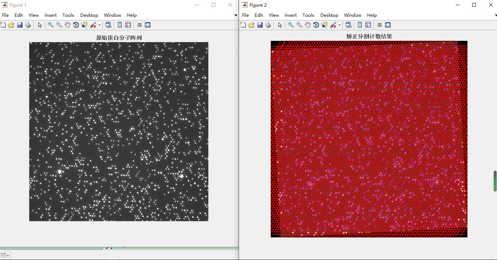

# 蛋白质荧光阵列矫正与识别计数方案

代码链接：[https://gitee.com/cocoon-storage/spot_detect](https://gitee.com/cocoon-storage/spot_detect)

## 前期准备

### 思路：深度学习（舍弃）

目标特征：

小目标，密集，图像分辩率高

适用网络：yolov5

1，该网络可以规定输入图像大小，可以保持高分辨率输入

2，训练之前会进行kmeans对锚框聚类，荧光点大小变化不大

3，有FPN,SPP多特征融合以防损失信息

修改：

预测时将原图分成256份送入网络进行预测，边缘点进行删除

将训练时的mocias策略删除

思路：

1图像校正，使图像与固定模板匹配或者学习得到一个模板。同时得到一个变换矩阵，用于后期坐标映射

2裁剪图像，模板匹配对齐，将每个网格化为5x5或3x3或1*1降低图像像素，转化方法可以考虑高斯均值

3（1）如果为1*1则进行二值化，然后直接得到点的坐标和计数

（2）如果为3*3可选择卷积学习

 

图像校正:

- radon变换（斜投影）
- FFT傅里叶转化到频域后求解

划分网格：

- 六边形网格，网格大小有细微差别，且为小数
- 正方形网格，类似砖墙

网格定位算法

- 爬山法
- 遗传算法
- 数学形态学
- 马尔科夫随机球场
- 贝叶斯网格定位
- 启发式规则算法

修正像素

问题：

- 旋转角度修正，得到6个角度怎么得到最佳旋转角度

- 投影边界得到的分割线有问题，要怎么利用中间得到的间隔。a:求平均投影值

- 分割后在小块内做自适应阈值处理

---

## 图像预处理（实操开始）

本身图片质量较高，采取预处理策略是**中值滤波+otsu自适应阈值二值化**

## 旋转矫正

### 裁剪1/16

由于整张图尺寸过大，所以进行裁剪，选取最易识别的一小块进行旋转矫正，进而反应整张图像的倾斜角。

### 傅里叶变换

矫正策略采取二维傅里叶变换，功率谱中**最亮的点**代表包含**成分最多的平面波**，**与原点所构成的向量**即为该平面**波传播方向**，**与原点距离**即为**频率**。频移后的功率谱呈中心对称

 

### 计算旋转角

由于噪声影响或者点分布影响会造成无法准确定位正确平面波位置，我采取了先归一化原图，后以60°为间隔，每个间隔找到最亮的点

 

但是我们要进行旋转就要挑选最小角度，所以我们把范围规定在中间六十度，找到的点，再以其自身为参考点，加入周围的一部分点**求取质心位置**进行修正。**该点与原点构成的向量与y轴的夹角即为倾斜角**。用**最邻近插值法**进行旋转

 

 

校正后为：

 

## 网格划分

- 使用间隔线分割成的格子
- 正六边形网格
- 正方形网格

### 1 仅使用间隔线分割成的格子

分割：图像点呈正六边形蜂窝状排布，我们规定他有3条轴，将原图进行旋转到3个轴的方向沿轴的方向进行投影，由于点间隔很小，利用二阶导数找出峰谷即可判定其为分割线，

画出并进行逆旋转到原图（边缘的处理还有待处理)

 

### 2 正六边形网格

因为**功率谱的频率可反应出周期**，又因为点的间隔很小，所以可以采取**定值计算**的方法，

根据功率谱所含频率最高的6个点求得**周期**，计算平均值，此值固定为**网格间距**。并根据**投影法**找到一个基准点定为原点，根据正六边形几何关系，画出网格。

 

### 3 正方形网格

水平投影一次找到横向间隔，**奇数偶数行分开**重新合并，再进行开操作去除分割瑕疵，纵向投影找到纵向分割线。根据几何关系映射到原图后画出网格即可

 

 

 

## 荧光检测与计数

本方法采用分割以后的检测每个子格进行荧光检测，因为正方形网格易分割，所以检测基于都基于正方形网格。

将网格分割成每个子格，因为分割采取的遍历投影，可能分割线会偏小，所以划分子格时分别向下和向右延伸一个像素，并对每个子格基于大津算法求出自适应阈值和最大类间方差，以最大类间方差为阈值进行第一次的筛选，方差小的认为无荧光，之后进行二值化，再在网格中央3*3区域进行白色检测，并规定阈值，如果小于阈值就判定为发生此格被串扰，无荧光。（之后为了提高精度应该要加更多判断条件，如连通域面积和连通域质心等等...）

下图为识别效果：（蓝色划线代表此网格有荧光）

 

## 最终前后处理对比
 

## 注释

### 傅里叶变换 （转载自各大网页原谅我记不清楚了:cry:）

傅立叶变换使我们能通过频率成分来分析一个函数。图像傅立叶变换的物理意义图像的频率是表征**图像中灰度变化剧烈程度的指标**，是灰度在平面空间上的梯度。如：大面积的沙漠在图像中是一片灰度变化缓慢的区域，对应的频率值很低；而对于地表属性变换剧烈的边缘区域在图像中是一片灰度变化剧烈的区域，对应的频率值较高。

傅立叶变换在实际中有非常明显的物理意义，设f是一个能量有限的模拟信号，则其傅立叶变换就表示f的谱。从纯粹的数学意义上看，傅立叶变换是将一个函数转换为一系列周期函数来处理的。从物理效果看，傅立叶变换是将图像从空间域转换到频率域，其逆变换是将图像从频率域转换到空间域。换句话说，**傅立叶变换的物理意义是将图像的灰度分布函数变换为图像的频率分布函数，傅立叶逆变换是将图像的频率分布函数变换为灰度分布函数傅立叶变换以前**，图像（未压缩的位图）是由对在连续空间（现实空间）上的采样得到一系列点的集合，我们习惯用一个二维矩阵表示空间上各点，则图像可由z=f(x,y)来表示。

由于空间是三维的，图像是二维的，因此空间中物体在另一个维度上的关系就由梯度来表示，这样我们可以通过观察图像得知物体在三维空间中的对应关系。为什么要提梯度？因为实际上对图像进行二维傅立叶变换得到频谱图，就是图像梯度的分布图，当然频谱图上的各点与图像上各点并不存在一一对应的关系，即使在不移频的情况下也是没有。**傅立叶频谱图上我们看到的明暗不一的亮点，实际上图像上某一点与邻域点差异的强弱，即梯度的大小，也即该点的频率的大小（可以这么理解，图像中的低频部分指低梯度的点，高频部分相反）**。一般来讲，**梯度大则该点的亮度强，否则该点亮度弱**。

这样通过观察傅立叶变换后的频谱图，也叫功率图，我们首先就可以看出，图像的能量分布。**如果频谱图中暗的点数更多，那么实际图像是比较柔和的（因为各点与邻域差异都不大，梯度相对较小），反之，如果频谱图中亮的点数多，那么实际图像一定是尖锐的，边界分明且边界两边像素差异较大的。**对频谱移频到原点以后，可以看出图像的频率分布是以原点为圆心，对称分布的。将频谱移频到圆心除了可以清晰地看出图像频率分布以外，还有一个好处，**它可以分离出有周期性规律的干扰信号**，比如正弦干扰，一副带有正弦干扰，移频到原点的频谱图上可以看出除了中心以外还存在以某一点为中心，对称分布的亮点集合，这个集合就是干扰噪音产生的，这时可以很直观的通过在该位置放置带阻滤波器消除干扰

另外我还想说明以下几点：1、图像经过二维傅立叶变换后，其变换系数矩阵表明：若变换矩阵Fn原点设在中心，其频谱能量集中分布在变换系数短阵的中心附近(图中阴影区)。若所用的二维傅立叶变换矩阵Fn的原点设在左上角，那么图像信号能量将集中在系数矩阵的四个角上。这是由二维傅立叶变换本身性质决定的。同时也表明一股图像能量集中低频区域。2 、变换之后的图像在原点平移之前四角是低频，最亮，平移之后中间部分是低频，最亮，亮度大说明低频的能量大（幅角比较大）

 

类比一维中，幅度和相位可以用一个复数表示，它可以作为我们存储的内容。但是还有两个：**频率和方向**。这时想到向量是有方向的，也是有长度的。所以我们用一个二维的矩阵的来保存分解之后得到的信息。这个矩阵就是K空间。（一般用k来表示空间频率，单位是1/m）

什么意思呢？**就是说一个二维矩阵点代表这个平面波的法向量，这个向量的模代表这个平面波的频率，这个点里面保存的内容复数就是此平面波的幅度和相位。**