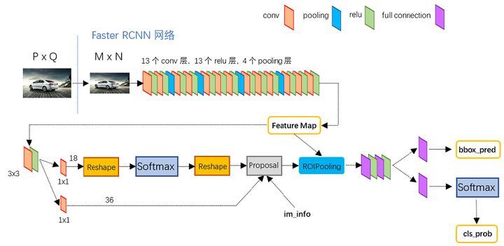

# Cascade RCNN论文解读

论文链接：https://arxiv.org/abs/1712.00726

代码链接：https://github.com/zhaoweicai/cascade-rcnn

## 前言

参考链接：https://zhuanlan.zhihu.com/p/31426458

### RPN

谈起RCNN网络，RPN网络可谓一大特色，究其根本，就是在feature map上每一点产生anchor，使用cnn网络去进行背景or目标的二分类

关注其rpn网络架构

- 先将feature map进行3$\times$3卷积送入之后的两个分支
- 上分支进行1$\times$1卷积使维度变为18（9个anchor*二分类）
- reshape对二分类情况做softmax，再恢复原状
- 由此生成Proposal

### ROI Pooling

**实现使生成的候选框region proposal映射产生固定大小的feature map。**

- 根据输入image，将提取的候选框region proposal映射到feature map的对应位置上，得到ROI；
2. 将映射后的ROI区域划分为相同大小的块sections（块sections的数量是我们指定的，它与输出的维度相同）；
- 对每个块sections进行max pooling操作；

## Abstract

检测性能会随着IOU的变化而改变，也就是说在一个IOU下的最佳检测器再另一个IOU下可能就不是了

Cascade RCNN有不同IOU的多级检测器，是对检测器的IOU进行优化为不是对假阳性率的优化

- 目标密集，高IOU会导致正样本数目e指数下降导致过拟合
- 高质量检测器只对高质量proposal有效，对其他质量就不一定了

> It consists of a sequence of detectors trained with increasing IoU thresholds, to be sequentially more selective against close false positives. The detectors are trained stage by stage, leveraging the observation that the output of a detector is a good distribution for training the next higher quality detector.

## Details

与faster-rcnn的区别

其中b与d的区别是cascade每个阶段的输入都由上一阶段的输出给出，训练也是按阶段进行，而b是由原始数据一起进行

