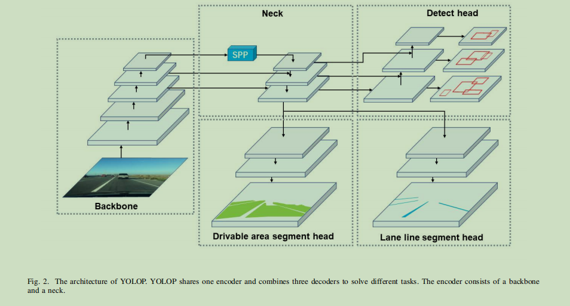

# YOLOP: You Only Look Once for Panoptic Driving Perception 论文解读

作者单位：华中科技大学

源码链接：https://github.com/hustvl/YOLOP

## Abstract

本文提出的网络可以同时完成目标检测，车道线检测以及道路分割，并可以在嵌入式设备TX2上达到23FPS的帧率

网络有一个编码器(Scaled-yolov4)和三个解码器，利用编码器提取特征之后分别送入三个解码去完成不同的任务

架构如下

## methodology

### Backbone

CSPDarkNet53 in Scaled-yolov4(优化过程中解决梯度重复)

### Neck

fuse SPP and FPN (SPP生成和融合不同尺度的特征，FPN融合不同语义层次的特征)

### Detection Decoder

Similar to YOLOV4. FPN transfers semantic features top-down, and PAN transfers positioning features bottom-up

本文将他们结合并最终利用PAN做出预测

### Segmentation Decoders

simple branch，特征图经过三次上采样，根据概率得到分割

